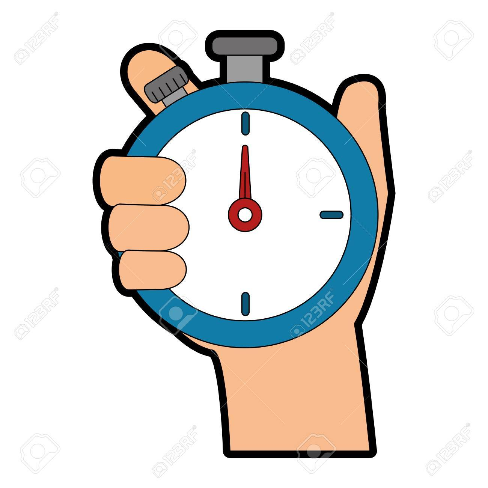

# Stopwacth🕐

Este é um projeto de um simples *Stopwacth(Cronômetro)* desenvolvido utilizando **HTML**, **CSS** e **JavaScript**.💻✨

## 🚀 Tecnologias Utilizadas

- **HTML**: Estrutura básica da página
- **CSS**: Estilos para a aparência da interface,  layout, cores e animações do cronômetro
- **JavaScript**: Lógica para realizar calcular o tempo 

## 🌐 Acesse Aqui

Você pode acessar  o cronômetro através deste [link](https://marcellofigueiredo.github.io/Stopwacth/).
